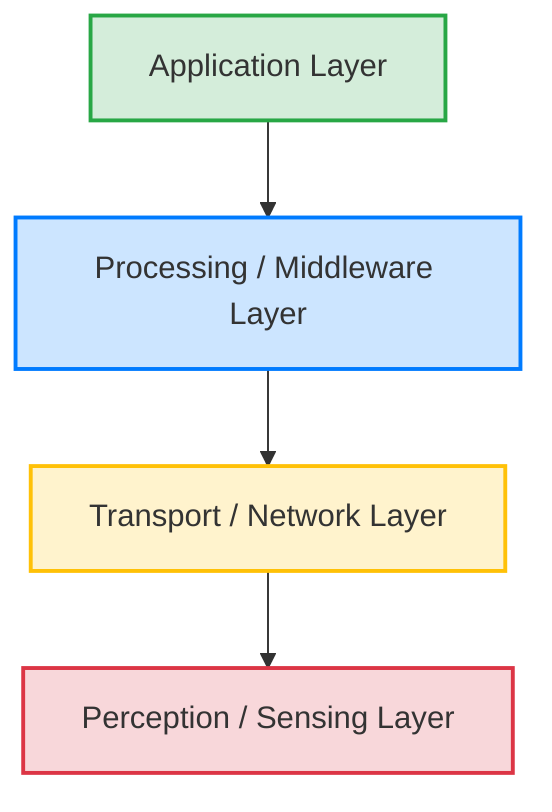
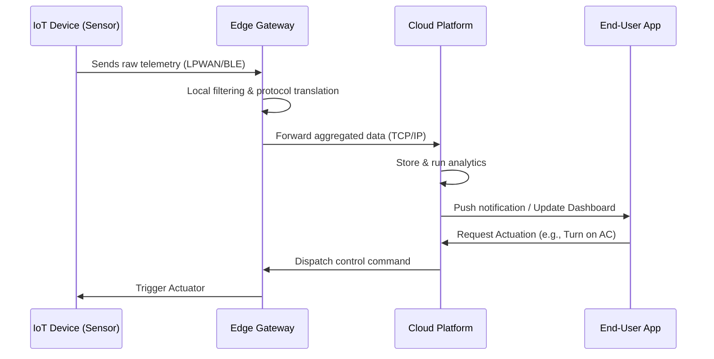

#IoT #CSE321 #ComputerNetworks #BUET #Sensors #EdgeComputing #SmartSystems

# Introduction to IoT (Internet of Things)

> [!definition] Internet of Things (IoT)
> A network of physical objects ("things") embedded with sensors, software, and communication technologies designed to seamlessly connect and exchange data with other devices and systems over the internet or closed networks, enabling automated monitoring and control.

## Motivation for IoT
Integrating traditional physical devices with a networked digital ecosystem provides several engineering and business advantages:
* **Operational Efficiency & Cost Savings:** Automation of routine tasks and optimized resource allocation (e.g., energy management).
* **Data-Driven Decision Making:** Aggregation of massive datasets from edge devices to drive machine learning models and predictive maintenance.
* **Enhanced Convenience & Quality of Life:** Autonomously adjusting environments (smart home automation).
* **Real-time Monitoring:** Immediate anomaly detection in critical infrastructure.

---

## Components of an IoT System

An end-to-end [[IoT Architecture]] relies on several interconnected hardware and software elements:

1. **IoT Devices:** The physical endpoints (appliances, industrial machines, vehicles, wearables) acting as the environment interface.
2. **[[Sensors and Actuators]]:**
    * *Sensors:* Convert physical phenomena (temperature, light, pressure) into digital data.
    * *Actuators:* Convert digital control signals into physical actions (motors, valves, relays).
    
3. **Embedded Processing Units:** Microcontrollers (MCUs) or microprocessors that handle local logic, ADC conversion, and temporary buffering.
4. **Connectivity Modules:** Hardware transceivers implementing specific communication protocols (Wi-Fi, Bluetooth, Cellular, [[LPWAN vs Cellular|LPWAN]]).
5. **IoT Gateways:** Intermediate devices that perform protocol translation (e.g., Zigbee to IP), local data aggregation, and initial security filtering.
6. **Cloud/[[Edge Computing Benefits|Edge Computing]]:** 
    * *Edge:* Localized processing to minimize latency and bandwidth.
    * *Cloud:* Centralized heavy compute for long-term storage and complex analytics.
7. **User Interface & Applications:** Dashboards, mobile apps, and automated alert systems for end-users.

 
<!-- Description: A diagram comparing a sensor computing environmental input to a digital signal vs. an actuator converting a digital signal into physical mechanical motion. -->

> [!tip] Power Budgeting in IoT Design
> Many edge devices are battery-powered. The total power budget $P_{total}$ must be carefully managed:
> $$ P_{total} = P_{sense} + P_{proc} + P_{comm} + P_{sleep} $$
> * **$P_{sense}$**: Power to operate the sensor.
> * **$P_{proc}$**: Power for the microcontroller.
> * **$P_{comm}$**: Transceiver power (often the highest consumer).
> * **$P_{sleep}$**: Quiescent current when the device is idle.

---

## IoT Architecture: 4-Layer Model

The system architecture is typically abstracted into four distinct layers.

### 1. Perception/Sensing Layer
The lowest layer defining the physical nodes. It includes sensors and actuators responsible for data acquisition and physical environment manipulation.

### 2. Transport/Network Layer
Handles the reliable transmission of data between the perception layer and the processing layer. Utilizes various wired/wireless protocols (Wi-Fi, Zigbee, BLE, LoRaWAN, 5G/Cellular).

> [!info] Network Latency in IoT
> Real-time control systems must account for total end-to-end latency $L_{total}$:
> $$ L_{total} = L_{prop} + L_{trans} + L_{proc} + L_{queue} $$
> * **$L_{prop}$**: Propagation delay over the medium.
> * **$L_{trans}$**: Transmission delay ($\frac{\text{Packet Size}}{\text{Link Bandwidth}}$).
> * **$L_{proc}$**: Processing delay at nodes/routers.
> * **$L_{queue}$**: Queuing delay in network buffers.

> [!tip] Wireless Module Selection (Link Budget)
> Successful transmission depends on maintaining an adequate Signal-to-Noise Ratio (SNR). The Link Budget equates transmitted power minus path loss and obstacles against receiver sensitivity.

### 3. Processing/Middleware Layer
Serves as the abstraction layer connecting hardware to applications. Responsibilities include data filtering, database storage, device management (firmware updates), semantic interoperability, and security enforcement (authentication/encryption).

### 4. Application Layer
The business logic and presentation layer. It houses the domain-specific applications, user-facing interfaces, and decision-support systems.

---

## IoT Applications

IoT principles are applied across diverse domains, transforming them into "Smart" ecosystems:

* **Smart Homes:** Automated HVAC, smart lighting, and security systems.
* **Smart Cities:** Intelligent traffic management, smart grid distribution, and digital waste management.
* **Healthcare & Wearables:** Remote patient monitoring (ECG, glucose), fitness tracking, and automated emergency alerts.
* **Industrial IoT (IIoT):** Automated manufacturing pipelines, predictive machine maintenance, and supply chain tracking.
* **Agriculture:** Smart irrigation systems using soil moisture sensors; precision agriculture for maximized crop yield.
* **Transportation & Logistics:** Real-time fleet tracking, dynamic route optimization, and cold-chain monitoring.

