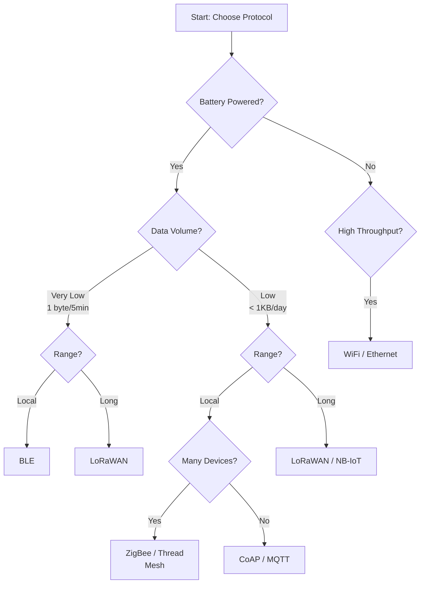
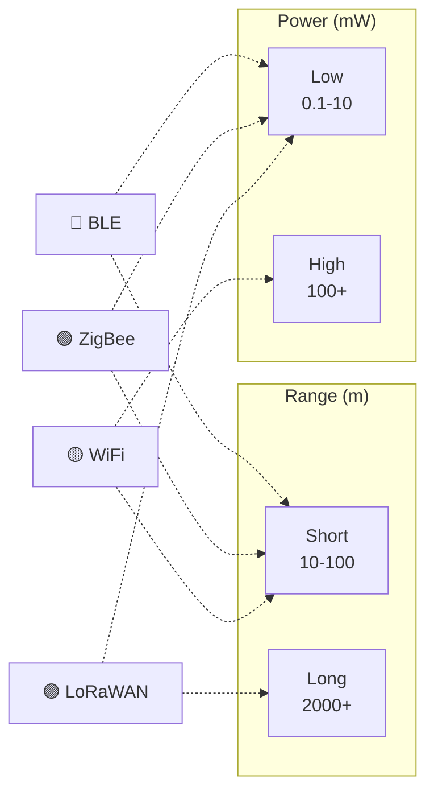

# CSE321: IoT Networking — First Principles

#IoT #CSE321 #Networking #BUET #IPv6 #MQTT #CoAP #LoRaWAN

---

## The Fundamental Problem

IoT systems sit at the intersection of **two worlds**:
- **Traditional internet:** Assumes reliable infrastructure, unlimited power, constant connectivity
- **Physical world:** Constrained resources, unreliable links, extreme scale

This gap forces every design decision. Understand the constraints → protocols follow naturally.

---

## Core Constraints (Why IoT is Different)

### 1. **Power Budget**
- A sensor on a coin cell: ~1000 mAh
- If it draws 1 mA average, it dies in 1000 hours (~40 days)
- But users expect **years** of operation

**Design consequence:** Minimize transmission time + maximize sleep time. Communications dominate power consumption (sending one byte ≈ 1000× computing that byte).

### 2. **Channel Scarcity & Interference**
- Radio spectrum is shared (2.4 GHz has WiFi, Bluetooth, ZigBee, microwave ovens)
- More devices = more collisions
- Collisions force retransmission = wasted power

**Design consequence:** Need efficient sharing schemes (TDMA, CSMA/CA) and resilience to interference.

### 3. **Scale**
- 4.3 billion IPv4 addresses → insufficient for billions of sensors
- Each sensor needs a unique, globally routable address
- Mesh networks with trillions of hop paths → routing complexity explodes

**Design consequence:** IPv6 (10³⁸ addresses), hierarchical routing (DAGs), edge aggregation.

### 4. **Unreliable Links**
- Wireless fading, multipath effects, low signal-to-noise ratios
- Packet loss rates of 10-50% are common (vs. <0.01% in wired networks)

**Design consequence:** Retransmission strategies, forward error correction, acknowledgments.

---

## Physical Layer: The Speed-Range Tradeoff

Why do different protocols have different ranges?

**Physics:** $\text{Range} \propto \frac{\text{Power}}{\text{Bit Rate}^2}$

- **High data rate** (e.g., WiFi 1 Gbps) → need massive power → short range
- **Low data rate** (e.g., LoRa 0.3 kbps) → can use minimal power → long range

This is **not a protocol choice**—it's a physical law. Protocols are designed around this reality.

| **Scenario** | **Bit Rate** | **Power** | **Range** | **Example** |
|---|---|---|---|---|
| "Talk to my phone" | ~2 Mbps | 1-10 mW | 10-100 m | BLE |
| "Mesh around my home" | 250 kbps | 10-50 mW | 10-100 m | ZigBee |
| "Talk everywhere" | 1 Gbps | 1+ W | 10-100 m | WiFi |
| "Talk to distant gateway" | 0.3-50 kbps | 0.1-1 mW | 2-15 km | LoRaWAN |

**Why is low data rate "acceptable" in IoT?** Sensors produce sparse data. A temperature sensor sends 1 byte every 5 minutes. A 0.3 kbps link handles 2880 bytes/day = 60+ sensors per gateway.

---

## MAC Layer: How Do Devices Share One Channel?

All wireless devices fight over one piece of spectrum. How do they avoid talking over each other?

### **CSMA/CA** (Carrier Sense, Multiple Access with Collision Avoidance)
Used by: ZigBee, WiFi, Bluetooth

1. Listen before talking ("Carrier sense")
2. If channel is quiet, talk. If busy, wait a random time
3. Random backoff prevents thundering herd (everyone waiting 1 sec, then retrying together)

**Why this works:** Low traffic density → channel usually quiet → minimal collisions.
**Why it breaks:** Too many devices → everyone detects collisions → everyone retries → collision hell.

### **TDMA** (Time-Division Multiple Access)
Used by: BLE, cellular, some industrial protocols

1. Time is sliced into fixed intervals
2. Device A gets slot 1, Device B gets slot 2, etc.
3. No collision possible (coordinated by master)

**Why this works:** Deterministic, collision-free, predictable latency.
**Why it's hard:** Requires synchronization and central scheduler. Bad for sporadic sensors.

### **ALOHA** (Listen if you want, just transmit)
Used by: LoRaWAN, some satellite systems

1. Transmit whenever you have data
2. If no ACK → retry later
3. Collisions are rare (because devices are sparse)

**Why this works:** Extremely simple, scales to massive numbers (if sparse). Good for one-way sensors.
**Why it fails:** Dense deployments → collision hell.

**Design insight:** Choose MAC based on device density and predictability, not arbitrary spec lists.

---

## Network Layer: The Addressing Crisis

### **IPv4:** 4.3 billion addresses
- In 2000: "That's enough for everyone!"
- In 2024: ~29 billion IoT devices exist

**Solution attempts:**
1. NAT (hide 1000 devices behind 1 IP) → breaks end-to-end connectivity
2. Proxy layers → adds latency, complexity, security holes

### **IPv6:** 3.4 × 10³⁸ addresses
- 7.9 × 10²⁸ addresses per person
- Every sensor can have a unique global address
- Direct device-to-device communication without NAT translation

**But IPv6 packets are 40 bytes headers** (vs IPv4's 20). On a 802.15.4 link with 127 byte frame size, that's 31% overhead.

**Solution:** **6LoWPAN** (IPv6 Low-Power Wireless Personal Area Network)
- Strip redundant headers (both sender/receiver are on same local link—reuse those)
- Compress variable headers (contiguous addresses → send only 1 byte delta)
- Result: 8 byte overhead instead of 40

**Design pattern:** Don't invent a new protocol. Compress existing ones to fit constrained links.

---

## Routing: Finding Paths in Lossy Mesh Networks

In traditional networks, routers memorize the topology. But:
- Wireless links appear/disappear due to fading
- Storing full topology on constrained nodes is expensive
- Periodic updates create broadcast storms

**RPL (Routing Protocol for Low-Power and Lossy Networks):** Key insight:

**Most IoT traffic flows toward a sink** (e.g., gateway, data center).

Don't build a full mesh routing table. Instead:
1. All nodes orient toward the sink using **Destination-Oriented DAG (DODAG)**
2. Metric = Expected Transmission Count (ETX): "How many retries before this link works?"
3. Higher ETX → packet takes longer → battery drains → avoid that path

**Design principle:** Exploit structure (most traffic toward center) rather than solving the general routing problem.

---

## Application Layer: Why TCP vs UDP? Why Publish-Subscribe?

### **Request-Response vs Pub-Sub**

**Request-Response (HTTP, CoAP):**
- Client: "Give me temperature"
- Server: [sends temperature]
- Problem: Client must know where server is. Scale to millions of sensors → millions of connections.

**Publish-Subscribe (MQTT):**
- Sensor: "Publishing /home/kitchen/temp = 24°C"
- Broker: Forwards to anyone subscribed to `/home/kitchen/temp`
- Benefit: Sensors don't know subscribers exist. Loose coupling.

**When to use:** Pub-Sub for many data producers (sensors) → few consumers (dashboards).

### **TCP vs UDP**

**TCP (connection-oriented):**
- Guarantees delivery, in order
- **Cost:** 3-way handshake (3 round trips) before sending data
- **Energy cost:** Power up radio 3 times

**UDP (connectionless):**
- No guarantee, may arrive out of order
- **Cost:** Send once, done
- **Energy cost:** Power up radio once

**For IoT:** UDP for one-way reports (e.g., "here's my sensor reading"). TCP for bidirectional control (e.g., "turn on the light").

---

## Header Overhead: Why Size Matters

A sensor sends 1 byte of data. But:

| **Layer** | **Overhead** | **Reason** |
|---|---|---|
| Application (MQTT) | ~2 bytes | Topic encoding |
| Transport (UDP) | 8 bytes | Port numbers |
| Network (IPv6 compressed) | ~8 bytes | Addresses |
| Link (802.15.4) | ~25 bytes | Frame synchronization, CRC |
| **Total** | **43 bytes** | **43× your data!** |

**Design consequence:** If you send frequently, overhead kills you. Batch messages or use compression.

---

## Encryption: Trust vs Battery

### **Why encrypt?**
Wireless is broadcast. Anyone can listen. Medical data, security systems need privacy.

### **Why not always encrypt?**
AES-128 encryption:
- 1000+ CPU cycles per block
- ~100 µJ per packet on typical IoT hardware
- Sensor battery draws 100 mJ/day from crypto alone

**Solutions:**
1. **Encrypt only sensitive data** (not all telemetry)
2. **Hardware crypto accelerators** (reduce to 5-10 µJ)
3. **DTLS vs TLS:** DTLS is stateless (no connection overhead), lighter on resources

**Design pattern:** Security-to-energy tradeoff is explicit and measured, not "just encrypt everything."

---

## Quick Decision Tree

**Ask yourself:**

1. **Is the device battery-powered?**
   - Yes → Low power protocol needed (BLE, LoRa, Zigbee)
   - No → Can use WiFi, Ethernet

2. **How much data per day?**
   - < 1 KB → Pub-Sub (MQTT), CoAP
   - > 1 MB → Request-response (HTTP), raw TCP

3. **How many devices?**
   - 10-100 → Star topology (gateway), CSMA/CA MAC (WiFi, BLE)
   - 1000+ → Mesh (ZigBee, Thread) or very sparse (LoRaWAN)

4. **Range needed?**
   - < 100 m → Local (WiFi, ZigBee, BLE)
   - > 1 km → Long-range (LoRaWAN, NB-IoT, cellular)

---

## Protocol Tradeoff Space (Visual)

---

## Common Mistakes (Thinking Traps)

❌ **"Let me use the most popular protocol"** → Wrong. Protocol must fit constraints.

❌ **"Why not just use WiFi everywhere?"** → Because 1W battery vs 10 mW means 100× fewer devices, and WiFi needs internet access.

❌ **"Mesh networks solve everything"** → Mesh scales to ~1000 nodes before routing chaos. Sparse LoRaWAN scales to millions (because fewer neighbors).

❌ **"Security = TLS always"** → TLS handshake = 10 seconds awake on some devices. May not fit power budget.