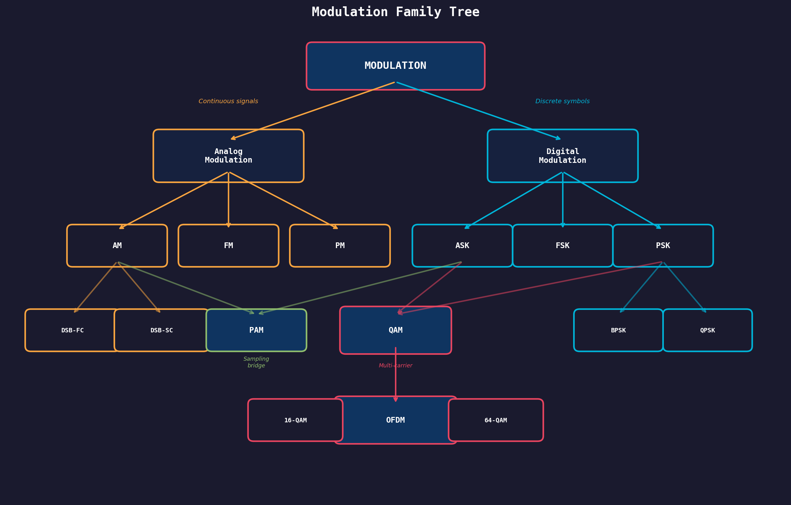

# Why Modulation Exists

> **Prerequisites**: None — this is where it all starts.
> **Next**: [[01 - Carrier Signals]], [[02 - Analog vs Digital Modulation]]

---

## The Foundational Problem

You want to send information — voice, data, video — from point A to point B **wirelessly**. The naive approach: just convert your signal to electromagnetic waves and blast it out.

**This fails spectacularly.** Here's why:

### Problem 1: Antenna Size

An antenna needs to be roughly **λ/4** (quarter wavelength) long to efficiently radiate a signal.

$$\lambda = \frac{c}{f}$$

| Signal | Frequency | Wavelength | Antenna Length (λ/4) |
|--------|-----------|------------|----------------------|
| Human voice | 3 kHz | 100 km | **25 km** ❌ |
| AM Radio | 1 MHz | 300 m | 75 m ✓ |
| FM Radio | 100 MHz | 3 m | 0.75 m ✓ |
| WiFi | 2.4 GHz | 12.5 cm | 3 cm ✓ |

A 25 km antenna for voice? Impossible. We **must** shift the signal to a higher frequency.

### Problem 2: Frequency Division

If everyone transmits at the same baseband frequency, all signals **overlap** and interfere. We need to assign different frequency bands to different users/stations.

> **Analogy**: Imagine a room where everyone speaks at the same pitch. Chaos. Now imagine everyone speaks at a different pitch — you can tune in to just one person. That's frequency division.

### Problem 3: Noise Performance

Baseband signals are vulnerable to low-frequency noise (1/f noise, power line interference at 50/60 Hz). Shifting to a higher frequency band **moves the signal away from these noise sources**.

---

## So What Is Modulation?

**Modulation = Encoding your information onto a high-frequency carrier signal.**

You take a **carrier** (a pure sinusoid at a known frequency) and **modify one of its properties** in proportion to your message signal.

```
Carrier: s(t) = A · cos(2πf_c·t + φ)
              ↑         ↑           ↑
         Amplitude   Frequency    Phase
         
Three knobs. Three families of modulation.
```

| Knob You Turn | Analog Version | Digital Version |
|---------------|---------------|-----------------|
| Amplitude | [[03 - Amplitude Modulation (AM)]] | [[07 - ASK and FSK]] (ASK) |
| Frequency | [[04 - Frequency Modulation (FM)]] | [[07 - ASK and FSK]] (FSK) |
| Phase | [[05 - Phase Modulation (PM)]] | [[08 - Phase Shift Keying (PSK)]] |
| Amplitude + Phase | — | [[09 - Quadrature Amplitude Modulation (QAM)]] |

---

## The Modulation Family Tree



Every modulation technique you'll learn is a specific answer to: **"How do I encode information onto a carrier?"**

The differences come from:
1. **Which parameter** you vary (amplitude, frequency, phase)
2. **Continuous vs discrete** variation (analog vs digital)
3. **How many bits** you pack per symbol
4. **How many carriers** you use simultaneously

---

## Connection Map

```
                    WHY MODULATE?
                         │
              ┌──────────┼──────────┐
              ▼          ▼          ▼
         Antenna    Frequency    Noise
          Size      Division    Immunity
              │          │          │
              └──────────┼──────────┘
                         ▼
               CARRIER SIGNAL  →  [[01 - Carrier Signals]]
                         │
              ┌──────────┴──────────┐
              ▼                     ▼
         ANALOG MOD            DIGITAL MOD
     [[03 - Amplitude Modulation (AM)]]  [[08 - Phase Shift Keying (PSK)]]
     [[04 - Frequency Modulation (FM)]]  [[09 - Quadrature Amplitude Modulation (QAM)]]
     [[05 - Phase Modulation (PM)]]      [[10 - OFDM]]
```

---

## Exam-Style Questions

1. **Why can't we transmit baseband audio directly as radio waves?** *(Hint: calculate the antenna length)*
2. **Name the three parameters of a sinusoidal carrier that can be modulated.** 
3. **How does modulation enable multiple users to share the same medium?** *(Frequency Division)*
4. **What is the relationship between carrier frequency and antenna size?** *(Inverse — higher fc = shorter antenna)*

---

> **Next Step**: Now that you know *why* we modulate, let's understand the **carrier signal itself** → [[01 - Carrier Signals]]
