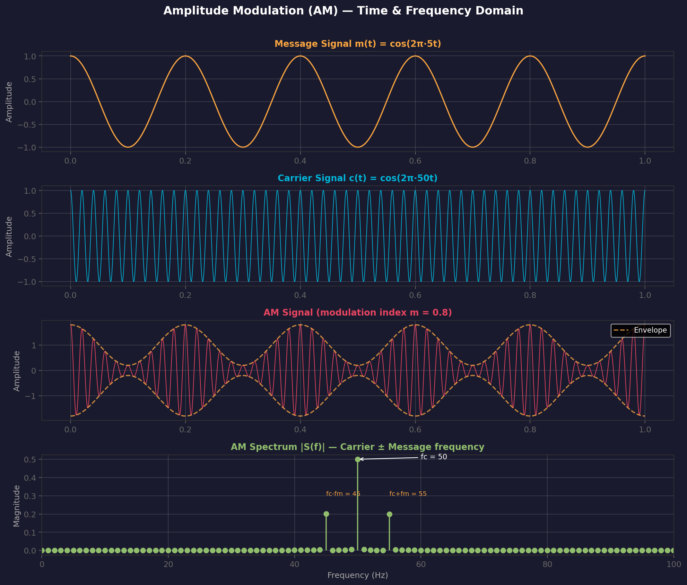

# Amplitude Modulation (AM)

> **Prerequisites**: [[00 - Why Modulation Exists]], [[01 - Carrier Signals]]
> **Related**: [[04 - Frequency Modulation (FM)]], [[05 - Phase Modulation (PM)]]
> **Digital counterpart**: [[07 - ASK and FSK]] (ASK)

---

## What Problem Does AM Solve?

You need the **simplest possible way** to shift a baseband signal to a higher frequency for transmission. AM is the answer: just multiply your message by a carrier.

> **Real-world context**: AM radio broadcasting (530–1700 kHz) has been operating since the 1920s. Its simplicity means a receiver can be built with a single diode — no complex circuitry needed.

---

## How Does It Work?

### Intuition

Imagine your message signal is a volume knob controlling the **height** of the carrier wave. When the message is loud (high amplitude), the carrier is tall. When the message is quiet, the carrier shrinks.

The **envelope** (outline) of the resulting wave **is** the message.

### Mechanism

The AM signal is:

$$s_{AM}(t) = A_c \left[1 + m \cdot \frac{m(t)}{A_m}\right] \cos(2\pi f_c t)$$

Simplified (with normalized message):

$$s_{AM}(t) = A_c [1 + m \cdot \cos(2\pi f_m t)] \cos(2\pi f_c t)$$

Where:
- $m$ = **modulation index** = $A_m / A_c$ (typically 0 < m ≤ 1)
- $f_c$ = carrier frequency
- $f_m$ = message frequency

### Expanding (the math that matters)

$$s_{AM}(t) = A_c \cos(2\pi f_c t) + \frac{mA_c}{2}\cos(2\pi(f_c + f_m)t) + \frac{mA_c}{2}\cos(2\pi(f_c - f_m)t)$$

| Component | Frequency | Name |
|-----------|-----------|------|
| $A_c \cos(2\pi f_c t)$ | $f_c$ | **Carrier** (no information!) |
| $\frac{mA_c}{2}\cos(2\pi(f_c+f_m)t)$ | $f_c + f_m$ | **Upper Sideband (USB)** |
| $\frac{mA_c}{2}\cos(2\pi(f_c-f_m)t)$ | $f_c - f_m$ | **Lower Sideband (LSB)** |

> **Critical insight**: The carrier itself carries **no information**. It wastes at least 50% of the transmitted power. Both sidebands contain the **same** information.

---

## AM Waveform & Spectrum

---

## Modulation Index and Overmodulation

| Condition | $m$ value | What Happens |
|-----------|-----------|--------------|
| Under-modulated | $0 < m < 1$ | Envelope faithfully reproduces message |
| 100% modulated | $m = 1$ | Envelope touches zero at troughs |
| **Over-modulated** | $m > 1$ | **Envelope distorts** — phase reversals, distortion |

$$\text{Modulation Index: } m = \frac{A_{max} - A_{min}}{A_{max} + A_{min}}$$

---

## AM Variants

| Variant | Full Name | Carrier? | Sidebands | Bandwidth | Efficiency |
|---------|-----------|----------|-----------|-----------|------------|
| **DSB-FC** | Double Sideband Full Carrier | ✅ Yes | Both | $2f_m$ | Low (~33% max) |
| **DSB-SC** | Double Sideband Suppressed Carrier | ❌ No | Both | $2f_m$ | Better |
| **SSB** | Single Sideband | ❌ No | One | $f_m$ | Best |
| **VSB** | Vestigial Sideband | Partial | 1 + vestige | $\approx f_m$ | TV broadcasting |

### Power Efficiency

For standard AM (DSB-FC) with modulation index $m$:

$$\eta = \frac{m^2}{2 + m^2} \times 100\%$$

At $m = 1$ (maximum): $\eta = 33.3\%$ — two-thirds of power is **wasted on the carrier**.

This is why SSB and DSB-SC exist: they remove the carrier and/or redundant sideband.

---

## Trade-Offs

| Dimension | Rating | Notes |
|-----------|--------|-------|
| Bandwidth efficiency | ★★☆☆ | BW = 2B (can improve with SSB → BW = B) |
| Noise immunity | ★☆☆☆ | Amplitude is the most noise-vulnerable parameter |
| Hardware complexity | ★★★★ | Envelope detector = 1 diode + capacitor |
| Power efficiency | ★★☆☆ | Carrier wastes 50%+ power |

---

## Where Is AM Used?

| Application | Why AM? |
|-------------|---------|
| **AM Radio** (530–1700 kHz) | Simple receivers, long range (ground wave propagation) |
| **Aircraft communication** | Simple, reliable, ground wave coverage |
| **CB Radio** | Cheap transceivers |
| **TV (legacy)** | VSB variant for video signal |

> AM is **not** used where noise immunity matters (music quality, data transmission). For that → [[04 - Frequency Modulation (FM)]].

---

## Connection Map

- **Parent**: [[01 - Carrier Signals]] (we're varying the amplitude knob)
- **Analog siblings**: [[04 - Frequency Modulation (FM)]] (vary frequency instead), [[05 - Phase Modulation (PM)]] (vary phase)
- **Digital descendant**: ASK in [[07 - ASK and FSK]] — same idea but discrete levels
- **Evolution**: PAM ([[06 - Pulse Amplitude Modulation (PAM)]]) takes AM's amplitude-varying idea and applies it to pulses
- **Compare all**: [[14 - Modulation Comparison Table]]
- **Bandwidth analysis**: [[11 - Bandwidth and Spectral Efficiency]]

---

## Exam-Style Questions

1. **Derive the bandwidth of a DSB-AM signal.** *(BW = 2f_m — show via frequency domain expansion)*
2. **What is the maximum power efficiency of standard AM? Why is it so low?** *(33.3% at m=1; carrier carries no info)*
3. **An AM signal has A_max = 10V and A_min = 2V. Find the modulation index.** *(m = (10-2)/(10+2) = 0.667)*
4. **Why does SSB use half the bandwidth of DSB? What's the trade-off?** *(Only one sideband; needs coherent demodulation — more complex receiver)*
5. **Why is AM more susceptible to noise than FM?** *(Noise directly adds to amplitude; FM encodes info in frequency → see [[04 - Frequency Modulation (FM)]])*

---

> **Next**: Why not vary frequency instead of amplitude? → [[04 - Frequency Modulation (FM)]]
