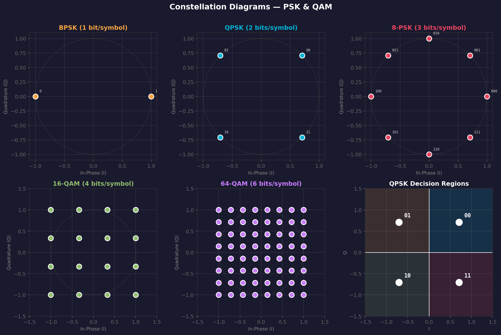

# Quadrature Amplitude Modulation (QAM)

> **Prerequisites**: [[01 - Carrier Signals]] (I/Q), [[06 - Pulse Amplitude Modulation (PAM)]], [[08 - Phase Shift Keying (PSK)]]
> **Next**: [[10 - OFDM]]
> **Related**: [[11 - Bandwidth and Spectral Efficiency]], [[12 - Noise and BER]]

---

## What Problem Does QAM Solve?

[[08 - Phase Shift Keying (PSK)]] hits a wall: beyond 8-PSK, adding more phase states pushes constellation points too close together. But we need **more bits per symbol** for high data rates.

**QAM's solution**: Use **both** amplitude **and** phase. Instead of placing points only on a circle (PSK), place them on a **grid** in the I/Q plane.

> **Analogy**: PSK is like having seats only along the edge of a circular table. QAM fills the entire table with seats — many more can fit.

---

## How Does It Work?

### The I/Q Framework

A QAM signal is:

$$s_{QAM}(t) = I_n \cdot g(t) \cos(2\pi f_c t) - Q_n \cdot g(t) \sin(2\pi f_c t)$$

Where:
- $I_n$ = in-phase PAM level (chosen from $\{-(M'-1), -(M'-3), \ldots, (M'-1)\}$, where $M' = \sqrt{M}$)
- $Q_n$ = quadrature PAM level (same set)
- $g(t)$ = pulse-shaping function
- Each $(I_n, Q_n)$ pair = one **symbol** carrying $\log_2 M$ bits

> **Key insight**: QAM = **two independent PAM streams in quadrature**. A $M$-QAM system is just two $\sqrt{M}$-PAM signals on cosine and sine carriers.

### QAM Orders

| Scheme | Grid | Bits/Symbol | PAM levels per axis |
|--------|------|-------------|-------------------|
| 4-QAM (= QPSK) | 2×2 | 2 | 2-PAM |
| 16-QAM | 4×4 | 4 | 4-PAM |
| 64-QAM | 8×8 | 6 | 8-PAM |
| 256-QAM | 16×16 | 8 | 16-PAM |
| 1024-QAM | 32×32 | 10 | 32-PAM |
| 4096-QAM | 64×64 | 12 | 64-PAM |

---

## Constellation Diagrams



The 16-QAM and 64-QAM constellations show the **rectangular grid** structure. Compare with PSK constellations (circle) in the same figure.

### Gray Coding

Adjacent constellation points should differ by **only 1 bit** (Gray coding). This ensures that the most likely error (jumping to a neighbor) causes only **1 bit error** instead of multiple.

```
16-QAM with Gray coding:
     -3    -1    +1    +3    ← I values
+3  0010  0110  1110  1010
+1  0011  0111  1111  1011   ← Q values
-1  0001  0101  1101  1001
-3  0000  0100  1100  1000
```

---

## QAM Bandwidth

QAM's bandwidth depends on the **symbol rate**, not the QAM order:

$$BW = (1 + r) \cdot R_s = (1 + r) \cdot \frac{R_b}{\log_2 M}$$

| Scheme | For 100 Mbps, r=0.25 | BW |
|--------|----------------------|-----|
| QPSK (4-QAM) | Rs = 50 Msps | 62.5 MHz |
| 16-QAM | Rs = 25 Msps | 31.25 MHz |
| 64-QAM | Rs ≈ 16.7 Msps | 20.8 MHz |
| 256-QAM | Rs = 12.5 Msps | 15.6 MHz |

> **The power of QAM**: Going from QPSK to 256-QAM transmits the same data rate in **1/4 the bandwidth**. But there's a cost...

---

## The Fundamental QAM Trade-Off

Higher-order QAM packs more bits but requires **higher SNR** to maintain the same BER:

$$d_{min} = \frac{2d}{\sqrt{M} - 1} \quad \text{(minimum distance between points)}$$

| Scheme | bits/symbol | Required Eb/N0 for BER=10⁻⁶ | Spectral Efficiency |
|--------|------------|------------------------------|---------------------|
| QPSK | 2 | 10.5 dB | 2 bits/s/Hz |
| 16-QAM | 4 | 14.5 dB | 4 bits/s/Hz |
| 64-QAM | 6 | 18.5 dB | 6 bits/s/Hz |
| 256-QAM | 8 | 22.5 dB | 8 bits/s/Hz |

Each **doubling** of QAM order needs ~4 dB more SNR but adds 1 extra bit/symbol.

This is why modern systems use **adaptive modulation**: choose the QAM order based on current channel conditions:
- Good signal (close to tower) → 256-QAM (fast)
- Poor signal (cell edge) → QPSK (reliable)

---

## QAM vs PSK — Why QAM Wins

For the same number of symbols $M$:

```
8-PSK constellation:          16-QAM constellation:
                               
    •   •                   •   •   •   •
  •       •                 •   •   •   •
  •       •                 •   •   •   •
    •   •                   •   •   •   •

8 points on circle          16 points on grid
3 bits/symbol               4 bits/symbol
d_min ≈ 0.77                d_min ≈ 0.63 (for same avg power)
```

16-QAM gives **more bits** than 8-PSK with comparable $d_{min}$. The grid layout uses the I/Q space more efficiently than a circle.

---

## QAM Demodulation

The receiver needs:
1. **Carrier recovery** — synchronize the local oscillator phase
2. **I/Q separation** — multiply by cos and sin references
3. **Symbol timing recovery** — sample at the right instant
4. **Decision** — map received (I, Q) to nearest constellation point

$$\hat{I}_n = \text{argmin}_{I_k} |r_I - I_k|, \qquad \hat{Q}_n = \text{argmin}_{Q_k} |r_Q - Q_k|$$

---

## Trade-Offs

| Dimension | Rating | Notes |
|-----------|--------|-------|
| Bandwidth efficiency | ★★★★ | **Best** among common schemes — up to 12 bits/s/Hz |
| Noise immunity | ★★☆☆ | Degrades with higher orders (points closer) |
| Complexity | ★★☆☆ | Needs accurate I/Q separation, AGC, carrier recovery |
| Power efficiency | ★★☆☆ | Variable envelope → needs linear amplifier |

> **The power amplifier problem**: Unlike PSK (constant envelope), QAM signals have **varying amplitude**. This requires a **linear** power amplifier (less efficient than Class C used for constant-envelope signals). This is a real cost in battery-powered devices.

---

## Where Is QAM Used?

| Application | QAM Order | Why? |
|-------------|-----------|------|
| **WiFi** (802.11ax) | Up to 1024-QAM | High indoor SNR → maximize throughput |
| **LTE/4G** | Up to 256-QAM | Adaptive modulation based on signal quality |
| **5G NR** | Up to 1024-QAM | Close to base station |
| **Cable TV** (DVB-C) | 64/256-QAM | Controlled cable environment → high SNR |
| **DSL/ADSL** | 2 to 32768-QAM | Per-subcarrier adaptive QAM |
| **Digital microwave** | Up to 4096-QAM | Point-to-point links with clear LOS |

See [[13 - Real World Systems]] for detailed system analysis.

---

## Connection Map

- **Parents**: [[06 - Pulse Amplitude Modulation (PAM)]] (QAM = 2×PAM) + [[08 - Phase Shift Keying (PSK)]] (QAM adds amplitude to PSK)
- **Foundation**: [[01 - Carrier Signals]] (I/Q representation)
- **Used by**: [[10 - OFDM]] — each OFDM subcarrier carries a QAM symbol
- **Analysis**: [[11 - Bandwidth and Spectral Efficiency]], [[12 - Noise and BER]]
- **Compared in**: [[14 - Modulation Comparison Table]]
- **Real-world deployment**: [[13 - Real World Systems]]

---

## Exam-Style Questions

1. **Explain why QAM can be viewed as two PAM signals in quadrature.** *(I and Q are independent PAM streams on cos/sin carriers)*
2. **A system uses 64-QAM at 20 MHz bandwidth with r=0.2. What is the maximum bit rate?** *(Rs = 20/1.2 ≈ 16.67 Msps, Rb = 16.67×6 = 100 Mbps)*
3. **Why does 256-QAM require ~12 dB more SNR than QPSK?** *(Points 8× closer → need 64× more power for same distance margin)*
4. **What is adaptive modulation and why is it used with QAM?** *(Change QAM order based on SNR — maximize throughput while maintaining BER)*
5. **Why can't QAM use Class C amplifiers?** *(Variable envelope → nonlinear amp would distort amplitude information)*
6. **Draw the 16-QAM constellation with Gray coding.**

---

> **Next**: What if you use QAM on hundreds of subcarriers simultaneously? → [[10 - OFDM]]
