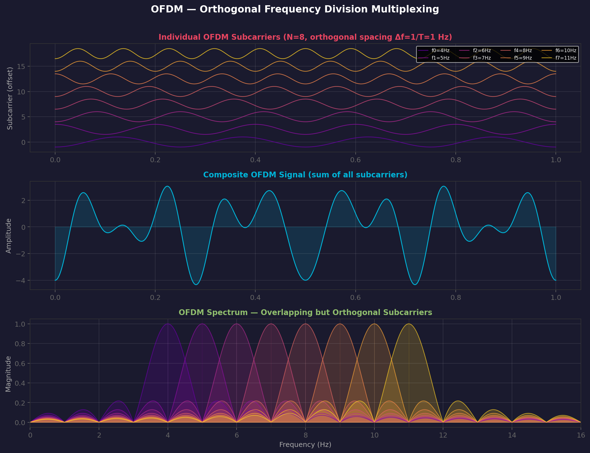

# OFDM — Orthogonal Frequency Division Multiplexing

> **Prerequisites**: [[09 - Quadrature Amplitude Modulation (QAM)]], [[06 - Pulse Amplitude Modulation (PAM)]]
> **Related**: [[11 - Bandwidth and Spectral Efficiency]], [[13 - Real World Systems]]

---

## What Problem Does OFDM Solve?

High data rates require **wide bandwidth**. But wide bandwidth channels suffer from **frequency-selective fading** — different frequencies fade differently due to multipath.

A single high-rate QAM signal across a wide band would be **destroyed** by this selective fading. OFDM's solution: **divide** the wide band into many narrow subcarriers, each carrying a low-rate QAM/PSK symbol.

> **Analogy**: Instead of driving one huge truck on a road with potholes (some lanes blocked), send many small cars — each takes a different lane. If one lane is blocked, only one car is affected.

---

## How Does It Work?

### Core Idea

Split available bandwidth $B$ into $N$ narrowband subcarriers, each of width $\Delta f = B/N$:

```
           ┌─────── Total Bandwidth B ───────┐
           │                                  │
Wideband:  ████████████████████████████████████  ← One fast QAM signal (vulnerable)
           
OFDM:      ▐▌ ▐▌ ▐▌ ▐▌ ▐▌ ▐▌ ▐▌ ▐▌ ▐▌ ▐▌ ▐▌  ← N slow QAM signals (robust)
           sc0 sc1 sc2 sc3 sc4 sc5 sc6 sc7 ...
```

Each subcarrier is **narrow enough** that its channel response is approximately **flat** (no frequency-selective fading within one subcarrier).

### Orthogonality

The subcarriers are spaced exactly $\Delta f = 1/T_{symbol}$ apart, where $T_{symbol}$ is the OFDM symbol duration. At this spacing, they are **orthogonal** — they overlap in frequency but don't interfere:

$$\int_0^{T} \cos(2\pi f_k t) \cdot \cos(2\pi f_j t) \, dt = 0 \quad \text{for } k \neq j$$

This is what makes OFDM spectrally efficient — subcarriers **overlap** without interference.

### Mathematical Expression

$$s(t) = \sum_{k=0}^{N-1} X_k \cdot e^{j2\pi f_k t}, \quad f_k = f_0 + k\Delta f$$

Where $X_k$ is the QAM/PSK symbol on subcarrier $k$.

> **Critical realization**: This is just the **Inverse DFT (IDFT)**! The transmitter computes an IFFT, the receiver computes an FFT. No analog oscillators needed for each subcarrier — it's all done digitally.

$$s[n] = \text{IFFT}\{X_k\} = \frac{1}{N}\sum_{k=0}^{N-1} X_k \cdot e^{j2\pi kn/N}$$

---

## OFDM Subcarrier Visualization



Notice in the spectrum plot: the sinc-shaped subcarriers **overlap**, but each subcarrier's peak aligns with the **nulls** of all other subcarriers — this is orthogonality.

---

## Cyclic Prefix (Guard Interval)

Multipath creates **inter-symbol interference (ISI)** — delayed copies of the previous symbol overlap with the current one.

**Solution**: Prepend a copy of the **last** part of the symbol to the beginning (cyclic prefix, CP):

```
Original symbol:  [────────── useful data ──────────]
                                    
With CP:          [CP][────────── useful data ──────────]
                   ↑
                   Copy of the tail
```

| Parameter | Formula |
|-----------|---------|
| CP length | $T_{CP} \geq \tau_{max}$ (max channel delay spread) |
| Guard interval overhead | $\frac{T_{CP}}{T_{CP} + T_{symbol}}$ |
| Typical overhead | 6.25% to 25% |

The CP converts the linear convolution of the channel into **circular convolution**, which is exactly what the DFT assumes — enabling perfect per-subcarrier equalization.

---

## OFDM Parameters (WiFi 802.11a/g example)

| Parameter | Value |
|-----------|-------|
| Bandwidth | 20 MHz |
| FFT size (N) | 64 |
| Subcarrier spacing (Δf) | 312.5 kHz |
| Used data subcarriers | 48 |
| Pilot subcarriers | 4 |
| Guard subcarriers | 12 |
| Symbol duration | 3.2 μs |
| Cyclic prefix | 0.8 μs |
| Total OFDM symbol | 4.0 μs |
| Max data rate (64-QAM, 3/4 code) | 54 Mbps |

---

## OFDM Advantages and Disadvantages

### Advantages

| Advantage | Why |
|-----------|-----|
| **Multipath robustness** | Narrow subcarriers → flat fading per subcarrier |
| **Simple equalization** | One complex multiply per subcarrier (vs. multi-tap equalizer) |
| **Spectral efficiency** | Overlapping orthogonal subcarriers → no guard bands needed |
| **Adaptive modulation** | Different QAM order per subcarrier based on channel quality |
| **Efficient implementation** | IFFT/FFT — fast, digital, well-understood |

### Disadvantages

| Disadvantage | Why It Matters |
|-------------|----------------|
| **High PAPR** | Sum of many subcarriers → high peak-to-average power ratio → needs linear (inefficient) amplifier |
| **Frequency offset sensitivity** | Small frequency error → loss of orthogonality → inter-carrier interference (ICI) |
| **CP overhead** | Wastes 6-25% of capacity |
| **Requires synchronization** | Time and frequency sync must be precise |

### PAPR Problem

$$\text{PAPR} = \frac{|s(t)|^2_{max}}{E[|s(t)|^2]} \leq N$$

With $N = 2048$ subcarriers (LTE), theoretical PAPR can be **33 dB**! In practice, 10-12 dB. Solutions:
- Clipping (distortion)
- Tone reservation
- Selected mapping (SLM)
- DFT-spreading → **SC-FDMA** (used in LTE uplink to reduce PAPR)

---

## OFDMA — Multi-User OFDM

Assign **different subsets** of subcarriers to different users:

```
User 1:  ▐▌ ▐▌ ▐▌ ▐▌ __ __ __ __ __ __ __ __
User 2:  __ __ __ __ ▐▌ ▐▌ ▐▌ ▐▌ __ __ __ __
User 3:  __ __ __ __ __ __ __ __ ▐▌ ▐▌ ▐▌ ▐▌
```

This is used in:
- **LTE/4G** downlink (OFDMA)
- **WiFi 6** (802.11ax) — OFDMA for multi-user
- **5G NR** downlink (OFDMA with flexible numerology)

---

## Trade-Offs

| Dimension | Rating | Notes |
|-----------|--------|-------|
| Bandwidth efficiency | ★★★★ | Overlapping subcarriers, adaptive QAM per subcarrier |
| Noise immunity | ★★★☆ | Good per subcarrier; PAPR is a weakness |
| Complexity | ★★☆☆ | FFT/IFFT is efficient, but sync is demanding |
| Multipath resilience | ★★★★ | **OFDM's superpower** — designed for multipath |

---

## Where Is OFDM Used?

| System | Standard | Why OFDM? |
|--------|----------|-----------|
| **WiFi** | 802.11a/g/n/ac/ax | Indoor multipath |
| **LTE/4G** | 3GPP LTE | Mobile multipath, OFDMA for multi-user |
| **5G NR** | 3GPP NR | Flexible numerology for diverse use cases |
| **DVB-T** | Digital terrestrial TV | Strong multipath in broadcast |
| **DAB** | Digital audio broadcast | Mobile reception |
| **DSL/ADSL** | DMT (Discrete Multi-Tone) | Frequency-selective phone line |
| **WiMAX** | 802.16 | Outdoor broadband |

See [[13 - Real World Systems]] for detailed analysis.

---

## Connection Map

- **Built on**: [[09 - Quadrature Amplitude Modulation (QAM)]] — each subcarrier carries QAM
- **Sampling**: [[06 - Pulse Amplitude Modulation (PAM)]] — PAM on each subcarrier
- **Bandwidth**: [[11 - Bandwidth and Spectral Efficiency]] — spectral efficiency analysis
- **Noise**: [[12 - Noise and BER]] — per-subcarrier BER analysis
- **Deployed in**: [[13 - Real World Systems]] — WiFi, LTE, 5G
- **Compared in**: [[14 - Modulation Comparison Table]]

---

## Exam-Style Questions

1. **Explain why OFDM is robust against frequency-selective fading.** *(Narrow subcarriers experience flat fading)*
2. **What is the role of the cyclic prefix?** *(Eliminates ISI, enables circular convolution for DFT-based processing)*
3. **How is an OFDM signal generated and received?** *(IFFT at transmitter, FFT at receiver)*
4. **What is the subcarrier spacing for WiFi with 64-point FFT and 20 MHz bandwidth?** *(20MHz/64 = 312.5 kHz)*
5. **What is PAPR and why is it a problem for OFDM?** *(High peaks require linear amplifier → power inefficiency)*
6. **How does OFDMA extend OFDM for multi-user access?** *(Assign subcarrier subsets to different users)*

---

> **Next**: Let's quantify all the bandwidth and efficiency numbers → [[11 - Bandwidth and Spectral Efficiency]]
