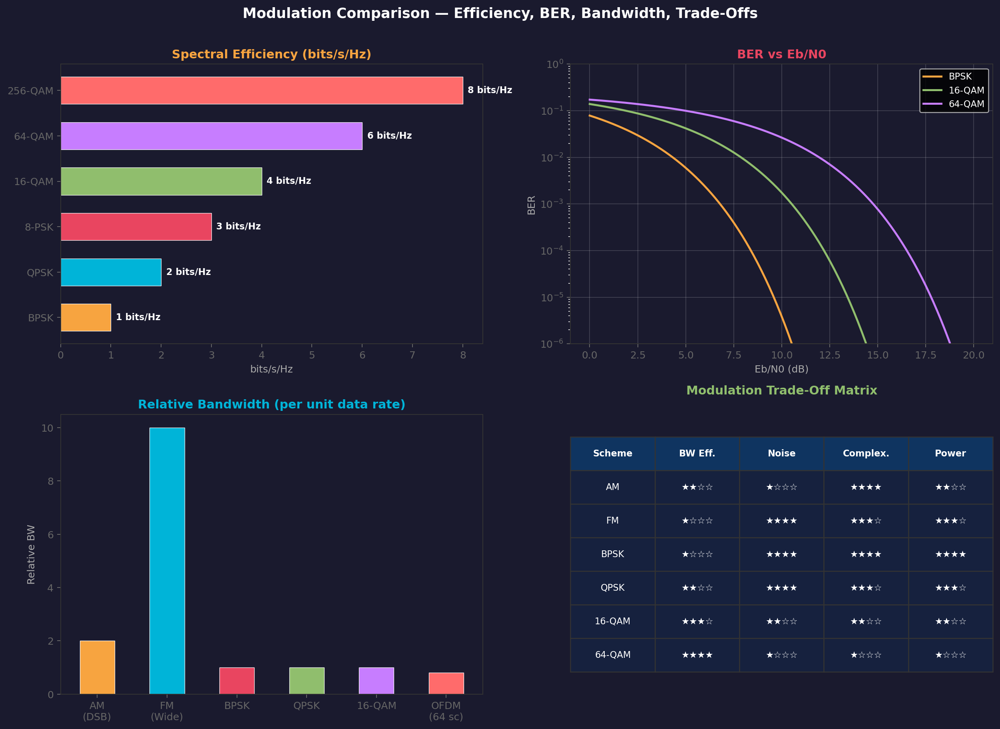

# Bandwidth and Spectral Efficiency

> **Prerequisites**: [[01 - Carrier Signals]], [[09 - Quadrature Amplitude Modulation (QAM)]]
> **Related**: [[12 - Noise and BER]], [[14 - Modulation Comparison Table]]

---

## The Two Fundamental Limits

Every communication system operates between two theoretical walls:

### 1. Nyquist Bandwidth Limit (Noiseless Channel)

$$\boxed{C = 2B \log_2 M \quad \text{bits/s}}$$

Where $B$ = bandwidth (Hz), $M$ = number of signal levels.

Maximum symbol rate through a channel of bandwidth $B$: **$R_s = 2B$ symbols/s** (Nyquist rate).

### 2. Shannon-Hartley Capacity (Noisy Channel)

$$\boxed{C = B \log_2\left(1 + \frac{S}{N}\right) \quad \text{bits/s}}$$

This is the **absolute maximum** bit rate achievable with **arbitrarily low error probability**. No modulation scheme can exceed this.

> **Key insight**: Shannon says you can always trade bandwidth for SNR and vice versa. More bandwidth → less SNR needed. Higher SNR → less bandwidth needed.

---

## Spectral Efficiency

$$\eta = \frac{R_b}{B} \quad \text{bits/s/Hz}$$

This is the **data rate per unit bandwidth** — the single most important metric for comparing modulation schemes.

### Spectral Efficiency of Common Schemes

| Scheme | bits/symbol ($\log_2 M$) | Theoretical η | Practical η (r=0.25) |
|--------|------------------------|---------------|----------------------|
| BPSK | 1 | 1 bits/s/Hz | 0.8 bits/s/Hz |
| QPSK | 2 | 2 bits/s/Hz | 1.6 bits/s/Hz |
| 8-PSK | 3 | 3 bits/s/Hz | 2.4 bits/s/Hz |
| 16-QAM | 4 | 4 bits/s/Hz | 3.2 bits/s/Hz |
| 64-QAM | 6 | 6 bits/s/Hz | 4.8 bits/s/Hz |
| 256-QAM | 8 | 8 bits/s/Hz | 6.4 bits/s/Hz |
| 1024-QAM | 10 | 10 bits/s/Hz | 8.0 bits/s/Hz |

Practical η is lower due to **roll-off factor** $r$: $\eta = \frac{\log_2 M}{1 + r}$

---

## Bandwidth Requirements by Modulation Type

### Analog Modulation

| Scheme | Bandwidth | Formula |
|--------|-----------|---------|
| AM (DSB-FC) | $2f_m$ | Carrier + 2 sidebands |
| AM (SSB) | $f_m$ | One sideband only |
| FM (wideband) | $2(\Delta f + f_m)$ | Carson's rule |
| PM | $2(\Delta\phi \cdot f_m + f_m)$ | Carson's rule (phase version) |

See [[03 - Amplitude Modulation (AM)]], [[04 - Frequency Modulation (FM)]], [[05 - Phase Modulation (PM)]] for derivations.

### Digital Modulation

For M-ary modulation with symbol rate $R_s$ and roll-off $r$:

$$BW = (1 + r) \cdot R_s = (1 + r) \cdot \frac{R_b}{\log_2 M}$$

| Scheme | BW for 10 Mbps (r=0.25) | η |
|--------|--------------------------|---|
| BPSK | 12.5 MHz | 0.8 |
| QPSK | 6.25 MHz | 1.6 |
| 16-QAM | 3.125 MHz | 3.2 |
| 64-QAM | 2.08 MHz | 4.8 |
| 256-QAM | 1.5625 MHz | 6.4 |

### OFDM Bandwidth

For $N$ subcarriers with spacing $\Delta f$:

$$BW_{OFDM} = N \cdot \Delta f, \qquad \Delta f = \frac{1}{T_{useful}}$$

Effective spectral efficiency includes CP overhead:

$$\eta_{OFDM} = \frac{N_{data}}{N_{total}} \cdot \frac{T_{useful}}{T_{useful} + T_{CP}} \cdot \log_2 M \cdot R_{code}$$

See [[10 - OFDM]] for full parameter calculation.

---

## Shannon Limit Visualization

The Shannon limit defines a **boundary** that no system can cross:

```
  Spectral Efficiency η (bits/s/Hz)
  ↑
  │                           Shannon Limit: η = log₂(1 + SNR)
  │                        ╱
 10├─────────────────────╱── 1024-QAM needs SNR ≈ 35 dB
  │                   ╱
  8├────────────────╱──── 256-QAM needs SNR ≈ 27 dB
  │              ╱
  6├───────────╱──────── 64-QAM needs SNR ≈ 22 dB
  │         ╱
  4├──────╱──────────── 16-QAM needs SNR ≈ 17 dB
  │    ╱
  2├─╱────────────────── QPSK needs SNR ≈ 10 dB
  │╱
  1├──────────────────── BPSK needs SNR ≈ 7 dB
  ┼───┼───┼───┼───┼───┼──→ SNR (dB)
  0   5  10  15  20  25  30
```

Each practical scheme operates 1-3 dB from the Shannon limit (with good coding).

---

## The Bandwidth-SNR Trade-Off

$$\text{Shannon:} \quad C = B \log_2(1 + S/N)$$

This can be rearranged:
- **Fixed data rate C**: more bandwidth → less SNR needed (and vice versa)
- **Fixed bandwidth B**: more SNR → more data rate
- **Fixed SNR**: more bandwidth → more data rate

| Strategy | When to use | Example |
|----------|-------------|---------|
| Narrow BW, high SNR | Spectrum is scarce | Cable TV (256-QAM in 6 MHz) |
| Wide BW, low SNR | SNR is low | GPS (BPSK spread across 20 MHz) |
| Balance | Typical wireless | WiFi (adaptive QAM in OFDM) |

---

## Comparison Charts



---

## Connection Map

- **Theory**: Nyquist and Shannon — the two fundamental limits
- **Applied to**: [[03 - Amplitude Modulation (AM)]] through [[10 - OFDM]] — each has its BW formula
- **Noise analysis**: [[12 - Noise and BER]] — SNR requirements for each scheme
- **System design**: [[13 - Real World Systems]] — why each system chooses its modulation
- **Summary table**: [[14 - Modulation Comparison Table]]

---

## Exam-Style Questions

1. **State the Nyquist bandwidth theorem and the Shannon-Hartley theorem. What does each tell us?**
2. **A channel has B=4MHz and SNR=31dB. What is the Shannon capacity?** *(C = 4M × log₂(1+1259) ≈ 4M × 10.3 ≈ 41.2 Mbps)*
3. **Calculate the spectral efficiency of 64-QAM with r=0.2.** *(η = 6/1.2 = 5 bits/s/Hz)*
4. **Why can't we just keep increasing QAM order to approach Shannon capacity?** *(Need exponentially more SNR → practical limit ≈ 1024-QAM)*
5. **Compare the bandwidth efficiency of FM radio vs WiFi. Why the huge difference?** *(FM: η ≈ 0.1 bits/s/Hz; WiFi: η ≈ 5+ bits/s/Hz — FM trades BW for noise immunity)*

---

> **Next**: How noise affects all these schemes → [[12 - Noise and BER]]
