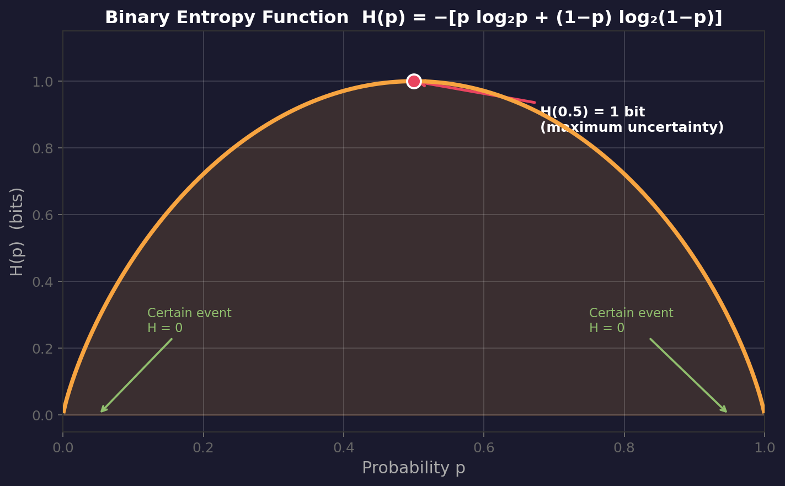

# Information Content and Entropy

> **Prerequisites**: Probability basics (independent events, expected value)
> **Next**: [[17 - Source Coding and Huffman Coding]], [[18 - Channel Capacity]]
> **Course**: CSE 311 — Data Communication (Md Asib Rahman)

---

## The Core Question: What *Is* Information?

Before diving into any formula, ask yourself: **when do you actually learn something?**

Consider three headlines:
1. *"The sun will rise tomorrow."*
2. *"United States invades Iran."*
3. *"Iran invades the United States."*

The first headline tells you **nothing** — you already expected it. The second is shocking. The third is *nearly unthinkable*. Each successive headline carries **more information** precisely because it is **less expected**.

> [!tip] The Surprise Principle
> **Information ∝ Surprise.** A message that tells you something you already knew carries zero information. A message that shatters your expectations carries enormous information.

This is not a vague metaphor — it is the exact mathematical foundation.

---

## Measure of Information

### Definition

> [!note] Information Content
> The **information content** (or **self-information**) of a message $m_i$ that occurs with probability $P_i$ is:
> $$I_i = \log_2 \frac{1}{P_i} = -\log_2 P_i \quad \text{(bits)}$$

**Variable definitions:**
- $I_i$ — information content of message $m_i$ (in bits)
- $P_i$ — probability of message $m_i$ occurring, where $0 < P_i \le 1$

### Why This Formula? Three Compelling Reasons

**Reason 1: Rare events should carry more information.**

| Event | Probability | Information $I = -\log_2 P$ |
|-------|-------------|----------------------------|
| Sun rises tomorrow | ≈ 1.0 | ≈ 0 bits |
| Fair coin lands heads | 0.5 | 1 bit |
| Roll a 6 on a die | 1/6 | 2.585 bits |
| Win the lottery | 10⁻⁸ | 26.6 bits |

As $P \to 1$, information $\to 0$ (certain events are boring).
As $P \to 0$, information $\to \infty$ (impossible events are infinitely surprising).

**Reason 2: Independent events should have additive information.**

If you flip two independent coins, the information from *both* outcomes should equal the sum of each. Mathematically, for independent events A and B:

$$P(A \cap B) = P(A) \cdot P(B)$$

$$I(A \cap B) = -\log_2[P(A) \cdot P(B)] = -\log_2 P(A) - \log_2 P(B) = I(A) + I(B) \checkmark$$

The logarithm is the **only** function that converts multiplication into addition. This is *why* we must use a logarithm — no other function works.

**Reason 3: The base of the logarithm just picks the unit.**

| Base | Unit | Usage |
|------|------|-------|
| 2 | **bits** | Digital communication, CS |
| $e$ | **nats** | Theoretical physics, math |
| 10 | **hartleys** | Older engineering texts |

We almost always use base 2 in this course.

### Worked Example

> A weather forecaster says there's a 1% chance of snow in Dhaka in May.

$$I = -\log_2(0.01) = -\log_2(10^{-2}) = 2 \times \log_2(10) = 2 \times 3.322 = 6.644 \text{ bits}$$

Compare: "It will be hot" with $P = 0.95$:

$$I = -\log_2(0.95) = 0.074 \text{ bits}$$

The snow message carries **90× more information** than the obvious heat message.

---

## Entropy: Average Information Per Message

### Motivation

A single message has information content $I_i$. But a **source** emits many messages over time. We need a measure of *how much information the source produces on average*.

### Setup: The Memoryless Source

> [!note] Memoryless Source
> A **memoryless source** emits messages $m_1, m_2, \ldots, m_n$ with probabilities $P_1, P_2, \ldots, P_n$ where:
> $$\sum_{i=1}^{n} P_i = 1$$
> Each message is **statistically independent** of all previous messages.

"Memoryless" means the source doesn't remember what it said before — like a biased die that doesn't care about previous rolls.

### The Entropy Formula

> [!important] Shannon Entropy
> The **entropy** of a memoryless source is the **expected value** of information content:
> $$H(m) = \sum_{i=1}^{n} P_i \, I_i = \sum_{i=1}^{n} P_i \log_2 \frac{1}{P_i} = -\sum_{i=1}^{n} P_i \log_2 P_i \quad \text{(bits/message)}$$

This is just the **weighted average** of $I_i$, weighted by how often each message appears.

### What Entropy Means (Three Interpretations)

1. **Average surprise**: How surprised are you, on average, by each message?
2. **Average uncertainty**: Before seeing the message, how uncertain are you about what it will be?
3. **Minimum bits needed**: The theoretical minimum average number of bits required to encode each message (Shannon's source coding theorem).

### Properties of Entropy

> [!note] Entropy Bounds
> For a source with $n$ possible messages:
> $$0 \le H(m) \le \log_2 n$$

**Maximum entropy** $H_{\max} = \log_2 n$ occurs when all messages are **equally likely** ($P_i = 1/n$ for all $i$). This is maximum uncertainty — you have no idea which message is coming.

**Minimum entropy** $H = 0$ occurs when one message has probability 1 and all others have probability 0. There's no uncertainty — you always know what's coming.

### Worked Example: Binary Source

Source emits $m_1$ with probability $p$ and $m_2$ with probability $1-p$.

$$H = -[p \log_2 p + (1-p) \log_2(1-p)]$$

This is the **binary entropy function** $H(p)$, one of the most important functions in information theory.

| $p$ | $H(p)$ | Interpretation |
|-----|---------|----------------|
| 0.0 | 0.000 | Always $m_2$ — no surprise |
| 0.1 | 0.469 | Mostly $m_2$ — low uncertainty |
| 0.3 | 0.881 | Somewhat predictable |
| 0.5 | **1.000** | **Maximum uncertainty** |
| 0.7 | 0.881 | Symmetric with $p=0.3$ |
| 0.9 | 0.469 | Mostly $m_1$ — low uncertainty |
| 1.0 | 0.000 | Always $m_1$ — no surprise |

The curve is **symmetric** around $p = 0.5$ and peaks at exactly 1 bit. This makes intuitive sense: a fair coin flip gives you exactly 1 bit of information.

---

## Connecting Information and Entropy to Communication

Why do engineers care about these abstract quantities?

1. **Entropy tells you the compression limit.** You cannot compress data below $H$ bits per message on average (Shannon's source coding theorem). Any attempt will lose information.

2. **Entropy measures source efficiency.** A source with low entropy relative to its alphabet size is "wasting" symbols — it's predictable and compressible.

3. **Entropy feeds into channel capacity.** The capacity formulas in [[18 - Channel Capacity]] are built from entropy. You cannot understand channels without understanding entropy first.

> [!tip] The Entropy Mental Model
> Think of entropy as the **price of uncertainty**. The more uncertain a source is, the more bits you need to faithfully represent its output. A completely predictable source (entropy = 0) needs zero bits. A maximally random source needs the most bits.

---

## Exam-Style Questions

1. **A source emits 4 messages with probabilities 0.5, 0.25, 0.125, 0.125. Calculate the entropy.**
   *(Answer: $H = 0.5(1) + 0.25(2) + 0.125(3) + 0.125(3) = 1.75$ bits/message)*

2. **Why must information content use a logarithm and not, say, $I = 1/P$?**
   *(Answer: Only logarithms make information additive for independent events)*

3. **A source has entropy 0. What can you say about its probability distribution?**
   *(Answer: One message has probability 1; all others have probability 0)*

4. **Which has higher entropy: English text or random ASCII characters? Why?**
   *(Answer: Random ASCII — English has redundancy, patterns, and unequal letter frequencies)*

---

> **Next Step**: Now that you understand *how much* information a source produces, learn how to *efficiently encode* it → [[17 - Source Coding and Huffman Coding]]
