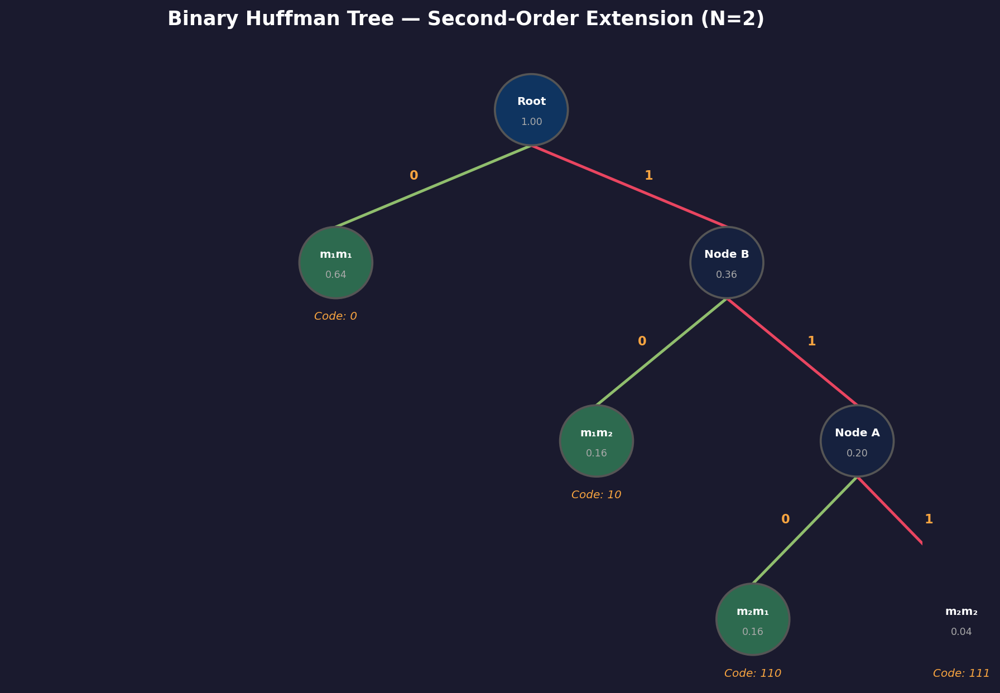
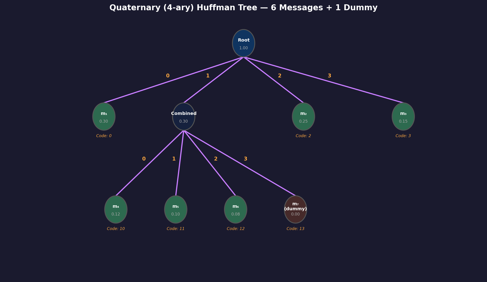

# Source Coding and Huffman Coding

> **Prerequisites**: [[16 - Information Content and Entropy]]
> **Next**: [[18 - Channel Capacity]]
> **Course**: CSE 311 — Data Communication (Md Asib Rahman)

---

## The Compression Problem

You have a source that emits messages with known probabilities. You need to encode each message as a sequence of symbols (bits, or quaternary digits, etc.) for transmission.

**The naive approach**: Use a fixed-length code. For $n$ messages, use $\lceil \log_2 n \rceil$ bits per message.

**The problem**: This ignores the probability distribution. If "A" appears 90% of the time and "Z" appears 0.1% of the time, why give them the same code length?

> [!tip] The Key Idea
> **Assign short codes to frequent messages, long codes to rare messages.** This is exactly what Morse code does — "E" (most common letter) is a single dot, while "Q" is dash-dash-dot-dash.

---

## Measuring Code Quality

### Average Code Length

> [!note] Average Code Length
> For a code that assigns codeword length $l_i$ to message $m_i$ with probability $P_i$:
> $$L = \sum_{i=1}^{n} P_i \cdot l_i \quad \text{(bits/message or symbols/message)}$$

### Code Efficiency

> [!note] Code Efficiency
> $$\eta = \frac{H(m)}{L}$$
> where $H(m)$ is the source entropy and $L$ is the average code length.

- $\eta = 1$ (100%) means the code is **perfect** — average length equals entropy
- $\eta < 1$ means there's room for improvement
- $\eta > 1$ is **impossible** for a valid code (Shannon's theorem guarantees $L \ge H$)

### Redundancy

> [!note] Redundancy
> $$\gamma = 1 - \eta$$

Redundancy is the fraction of bits that are "wasted" — they don't carry information.

**Goal**: Minimize $\gamma$ (equivalently, maximize $\eta$, equivalently, make $L$ approach $H(m)$).

---

## Huffman Coding Algorithm

David Huffman (1952) invented an algorithm that produces the **optimal prefix-free code** — no other prefix-free code can achieve a shorter average length.

### Binary Huffman Coding

**Algorithm:**
1. List all messages sorted by probability (highest first)
2. Take the **2 least probable** messages, combine them into a single node with summed probability
3. Re-sort the list
4. Repeat steps 2–3 until only one node remains (this builds the tree from leaves to root)
5. Assign `0` and `1` to each branch at every split
6. Read codes from root to leaf

### $r$-ary Huffman Coding

For an $r$-ary code (using symbols $\{0, 1, \ldots, r-1\}$), combine the **$r$ least probable** messages at each step instead of 2.

> [!warning] Padding Rule for $r$-ary Codes
> The number of messages must satisfy $n \equiv 1 \pmod{r-1}$, i.e., $(n-1)$ must be divisible by $(r-1)$. If not, add **dummy messages with probability 0** until the condition is met.
>
> For quaternary ($r=4$): need $n \equiv 1 \pmod{3}$, so $n = 4, 7, 10, \ldots$
> For $n=6$: $6 - 1 = 5$, and $5 \mod 3 = 2 \ne 0$. We need to add 1 dummy → $n=7$.

---

## Worked Example 1: Binary Huffman Code (Second-Order Extension)

### Given

A simple binary source: $m_1$ (prob $0.8$), $m_2$ (prob $0.2$).

### First Order ($N=1$): Direct Encoding

**Entropy:**
$$H = -(0.8 \log_2 0.8 + 0.2 \log_2 0.2)$$
$$= -(0.8 \times (-0.322) + 0.2 \times (-2.322))$$
$$= -(-0.258 - 0.464) = 0.722 \text{ bits/message}$$

**Code (trivial — only 2 messages):**

| Message | Probability | Code | Length |
|---------|-------------|------|--------|
| $m_1$ | 0.80 | 0 | 1 |
| $m_2$ | 0.20 | 1 | 1 |

**Average length:** $L = 0.8(1) + 0.2(1) = 1.0$ bit

**Efficiency:** $\eta = 0.722 / 1.0 = 72.2\%$

That's terrible! We're wasting 27.8% of our bits. The problem: with only 2 messages, both *must* get 1-bit codes. There's no room to give the frequent message a shorter code.

**Solution**: Code *sequences* of messages instead of individual messages.

---

### Second Order ($N=2$): Coding Pairs

Instead of coding one message at a time, we group messages into **pairs** and code each pair.

**Possible pairs** (since the source is memoryless, joint probability = product):

| Pair | Probability | Calculation |
|------|-------------|-------------|
| $m_1 m_1$ | 0.64 | $0.8 \times 0.8$ |
| $m_1 m_2$ | 0.16 | $0.8 \times 0.2$ |
| $m_2 m_1$ | 0.16 | $0.2 \times 0.8$ |
| $m_2 m_2$ | 0.04 | $0.2 \times 0.2$ |

**Verification:** $0.64 + 0.16 + 0.16 + 0.04 = 1.00$ ✓

**Build the Huffman tree:**

```
Step 1: Sort by probability
  m1m1 (0.64), m1m2 (0.16), m2m1 (0.16), m2m2 (0.04)

Step 2: Combine two smallest → m2m1(0.16) + m2m2(0.04) = Node_A(0.20)
  m1m1 (0.64), Node_A (0.20), m1m2 (0.16)

Step 3: Combine two smallest → Node_A(0.20) + m1m2(0.16) = Node_B(0.36)
  m1m1 (0.64), Node_B (0.36)

Step 4: Combine last two → Root(1.00)
  Root (1.00)
```

**Tree diagram:**



**Resulting codes:**

| Pair | Probability | Code | Length |
|------|-------------|------|--------|
| $m_1 m_1$ | 0.64 | `0` | 1 |
| $m_1 m_2$ | 0.16 | `10` | 2 |
| $m_2 m_1$ | 0.16 | `110` | 3 |
| $m_2 m_2$ | 0.04 | `111` | 3 |

**Average code length per pair:**
$$L_{\text{pair}} = 0.64(1) + 0.16(2) + 0.16(3) + 0.04(3) = 0.64 + 0.32 + 0.48 + 0.12 = 1.56 \text{ bits}$$

**Per message:** $L = 1.56 / 2 = 0.78$ bits

**Efficiency:** $\eta = 0.722 / 0.78 = 92.6\%$ ✓

> [!tip] Dramatic improvement! From 72.2% → 92.6% just by coding pairs instead of singles.

---

### Third Order ($N=3$): Coding Triples

Now code triples of messages. There are $2^3 = 8$ possible triples:

| Sequence | Probability |
|----------|-------------|
| $m_1 m_1 m_1$ | $0.8^3 = 0.512$ |
| $m_1 m_1 m_2$ | $0.8^2 \times 0.2 = 0.128$ |
| $m_1 m_2 m_1$ | $0.128$ |
| $m_2 m_1 m_1$ | $0.128$ |
| $m_1 m_2 m_2$ | $0.8 \times 0.2^2 = 0.032$ |
| $m_2 m_1 m_2$ | $0.032$ |
| $m_2 m_2 m_1$ | $0.032$ |
| $m_2 m_2 m_2$ | $0.2^3 = 0.008$ |

**Huffman codes:**

| Sequence | Probability | Code | Length |
|----------|-------------|------|--------|
| $m_1 m_1 m_1$ | 0.512 | `0` | 1 |
| $m_1 m_1 m_2$ | 0.128 | `100` | 3 |
| $m_1 m_2 m_1$ | 0.128 | `101` | 3 |
| $m_2 m_1 m_1$ | 0.128 | `110` | 3 |
| $m_1 m_2 m_2$ | 0.032 | `11100` | 5 |
| $m_2 m_1 m_2$ | 0.032 | `11101` | 5 |
| $m_2 m_2 m_1$ | 0.032 | `11110` | 5 |
| $m_2 m_2 m_2$ | 0.008 | `11111` | 5 |

**Average code length per triple:**
$$L_{\text{triple}} = 0.512(1) + 3 \times 0.128(3) + 3 \times 0.032(5) + 0.008(5)$$
$$= 0.512 + 1.152 + 0.480 + 0.040 = 2.184 \text{ bits}$$

**Per message:** $L = 2.184 / 3 = 0.728$ bits

**Efficiency:** $\eta = 0.722 / 0.728 = 99.2\%$

### The Extension Principle — Summary

| Extension Order $N$ | Avg. Length/Message | Efficiency |
|---------------------|--------------------:|----------:|
| 1 | 1.000 bits | 72.2% |
| 2 | 0.780 bits | 92.6% |
| 3 | 0.728 bits | 99.2% |
| $\infty$ | 0.722 bits | 100% |

> [!important] Shannon's Source Coding Theorem
> As the extension order $N \to \infty$, the average code length per message $L \to H(m)$ and efficiency $\eta \to 1$. The entropy $H(m)$ is the **absolute minimum** average bits per message for lossless compression.

**The trade-off**: Higher extension order gives better efficiency, but requires exponentially more codewords ($2^N$ for a binary source with 2 messages). Practical systems choose a finite $N$ that balances efficiency against complexity.

---

## Worked Example 2: Quaternary (4-ary) Huffman Code

### Given

6 messages with a 4-symbol alphabet $\{0, 1, 2, 3\}$:

| Message | Probability |
|---------|-------------|
| $m_1$ | 0.30 |
| $m_2$ | 0.25 |
| $m_3$ | 0.15 |
| $m_4$ | 0.12 |
| $m_5$ | 0.10 |
| $m_6$ | 0.08 |

### Check Padding

For $r = 4$: need $(n - 1) \mod (r - 1) = 0$, i.e., $(6 - 1) \mod 3 = 5 \mod 3 = 2 \ne 0$.

Add 1 dummy message ($m_7$ with prob 0) → $n = 7$, check: $(7-1) \mod 3 = 0$ ✓.

### Build the Tree

**Iteration 1:** Combine 4 lowest: $m_5(0.10)$, $m_6(0.08)$, $m_7(0.00)$, $m_4(0.12)$
- Combined probability: $0.10 + 0.08 + 0.00 + 0.12 = 0.30$
- Reduced source: **Combined(0.30)**, $m_1(0.30)$, $m_2(0.25)$, $m_3(0.15)$

**Iteration 2:** Sort: $m_1(0.30)$, Combined(0.30), $m_2(0.25)$, $m_3(0.15)$
- Combine all 4 → Root(1.00)

**Tree:**



### Resulting Code

| Message | Probability | Code | Length |
|---------|-------------|------|--------|
| $m_1$ | 0.30 | `0` | 1 |
| $m_2$ | 0.25 | `2` | 1 |
| $m_3$ | 0.15 | `3` | 1 |
| $m_4$ | 0.12 | `10` | 2 |
| $m_5$ | 0.10 | `11` | 2 |
| $m_6$ | 0.08 | `12` | 2 |

(The dummy $m_7$ gets code `13` but is never used.)

### Calculate Metrics

**Step 1: Entropy (in bits)**

$$H(m) = -\sum P_i \log_2 P_i$$

| $P_i$ | $\log_2 P_i$ | $P_i \log_2 P_i$ |
|--------|-------------|-------------------|
| 0.30 | −1.737 | −0.521 |
| 0.25 | −2.000 | −0.500 |
| 0.15 | −2.737 | −0.411 |
| 0.12 | −3.059 | −0.367 |
| 0.10 | −3.322 | −0.332 |
| 0.08 | −3.644 | −0.292 |

$$H(m) = 0.521 + 0.500 + 0.411 + 0.367 + 0.332 + 0.292 = 2.423 \text{ bits/message}$$

**Step 2: Average code length (in quaternary symbols)**

$$L = \sum P_i \cdot l_i = 0.30(1) + 0.25(1) + 0.15(1) + 0.12(2) + 0.10(2) + 0.08(2)$$
$$= 0.30 + 0.25 + 0.15 + 0.24 + 0.20 + 0.16 = 1.30 \text{ quaternary symbols/message}$$

**Step 3: Efficiency**

> [!warning] Unit Mismatch
> Entropy is in **bits** but code length is in **quaternary symbols**. Each quaternary symbol carries $\log_2 4 = 2$ bits. We must use consistent units.

**Method A** — Convert entropy to quaternary units:
$$H_4(m) = \frac{H_2(m)}{\log_2 4} = \frac{2.423}{2} = 1.212 \text{ quat. symbols/message}$$

$$\eta = \frac{H_4(m)}{L} = \frac{1.212}{1.30} = 93.2\%$$

**Method B** — Convert code length to bits:
$$L_{\text{bits}} = L \times \log_2 4 = 1.30 \times 2 = 2.60 \text{ bits/message}$$

$$\eta = \frac{H_2(m)}{L_{\text{bits}}} = \frac{2.423}{2.60} = 93.2\%$$

Both methods give the same answer. **Redundancy:** $\gamma = 1 - 0.932 = 6.8\%$.

---

## Why Huffman Coding Is Optimal (Intuition)

Huffman coding achieves the **shortest possible average code length** among all prefix-free codes. The key insights:

1. **Greedy optimality**: By always merging the least probable symbols, we push rare symbols to the bottom of the tree (longer codes) and keep frequent symbols near the top (shorter codes).

2. **Prefix-free property**: No codeword is a prefix of another, so the code is **uniquely decodable** without delimiters. E.g., if `0` is a code, then `00`, `01`, etc. cannot be codes.

3. **Limitation**: For a single message, the code length must be an integer, so $L \ge H(m)$ always holds. Equality is only possible when all probabilities are negative powers of 2 (e.g., $1/2, 1/4, 1/8$).

---

## Exam-Style Questions

1. **Construct a binary Huffman code for messages with probabilities 0.4, 0.2, 0.2, 0.1, 0.1. Calculate efficiency.**

2. **Why does the second-order extension improve efficiency?**
   *(Answer: It creates more distinct probability levels, allowing the Huffman algorithm to better match code lengths to actual information content.)*

3. **For a 4-ary Huffman code with 10 messages, do you need dummy messages?**
   *(Answer: $(10-1) \mod 3 = 0$. No dummies needed.)*

4. **A source has entropy 3.0 bits. A binary Huffman code achieves $L = 3.2$ bits. What is the efficiency and redundancy?**
   *(Answer: $\eta = 3.0/3.2 = 93.75\%$, $\gamma = 6.25\%$)*

---

> **Next Step**: You can now compress data efficiently. But what about sending it through a **noisy channel**? → [[18 - Channel Capacity]]
