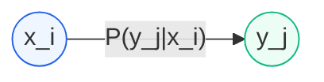

# Channel Capacity

> **Prerequisites**: [[16 - Information Content and Entropy]]
> **Next**: [[19 - Shannon's Channel Capacity Theorem]]
> **Course**: CSE 311 — Data Communication (Md Asib Rahman)

---

## The Noisy Channel Problem

So far, we've studied the **source** — how much information it produces and how to compress it. Now we face the real world: the **channel** between sender and receiver introduces **noise**.

**The fundamental question**: How fast can we transmit information through a noisy channel *and still recover it perfectly*?

---

## Error-Free Transmission Setup

> [!note] Key Variables
> - $\alpha T$ = number of **information digits** (the actual data)
> - $\beta T$ = number of **total transmitted digits** (data + redundancy)
> - $(\beta - \alpha)T$ = number of **check digits** (redundancy for error correction)
> - $P_e$ = error probability per bit in the channel
> - $C_s$ = channel capacity (bits per channel use)

The ratio $\alpha / \beta$ is the **code rate** $R$ — the fraction of transmitted bits that carry actual information.

> [!important] Fundamental Condition
> Error-free transmission is possible **if and only if**:
> $$R = \frac{\alpha}{\beta} < C_s$$
> The information rate must be **strictly less than** the channel capacity.

This is Shannon's revolutionary result: **reliable communication is possible over noisy channels**, as long as you don't exceed the capacity. The price is redundancy — you must transmit more digits than you have information digits.

---

## Mutual Information: The Heart of Channel Capacity

### Setup: Discrete Memoryless Channel

A **discrete memoryless channel** (DMC) has:
- Input alphabet: $x_1, x_2, \ldots, x_M$ with probabilities $P(x_i)$
- Output alphabet: $y_1, y_2, \ldots, y_K$
- **Transition probabilities**: $P(y_j | x_i)$ — the probability of receiving $y_j$ when $x_i$ was sent

"Memoryless" means each channel use is independent — the noise on one symbol doesn't affect the next.

### Three Entropy Quantities

**1. Input entropy** $H(x)$ — uncertainty about what was sent:
$$H(x) = -\sum_i P(x_i) \log_2 P(x_i)$$

**2. Output entropy** $H(y)$ — uncertainty about what is received:
$$H(y) = -\sum_j P(y_j) \log_2 P(y_j)$$

**3. Conditional entropy (equivocation)** $H(x|y)$ — remaining uncertainty about what was sent *after* observing the output:

> [!note] Equivocation
> $$H(x|y) = \sum_i \sum_j P(x_i, y_j) \log_2 \frac{1}{P(x_i | y_j)} \quad \text{(bits/symbol)}$$

This is the crucial quantity. If $H(x|y) = 0$, the receiver knows exactly what was sent (perfect channel). If $H(x|y) = H(x)$, the output tells you *nothing* about the input (useless channel).

### Mutual Information

> [!important] Mutual Information
> The **mutual information** between input $x$ and output $y$ is:
> $$I(x; y) = H(x) - H(x|y) \quad \text{(bits/symbol)}$$
>
> **Meaning**: How much does observing the output **reduce** your uncertainty about the input?

**Equivalent forms** (all give the same number):

$$I(x; y) = \sum_i \sum_j P(x_i, y_j) \log_2 \frac{P(x_i | y_j)}{P(x_i)}$$

$$I(x; y) = \sum_i \sum_j P(x_i, y_j) \log_2 \frac{P(x_i, y_j)}{P(x_i) P(y_j)}$$

$$I(x; y) = \sum_i \sum_j P(x_i) P(y_j | x_i) \log_2 \frac{P(y_j | x_i)}{P(y_j)}$$

The third form is often most convenient because we usually know $P(x_i)$ (our input distribution) and $P(y_j|x_i)$ (the channel model).

**Key properties of mutual information:**
- $I(x; y) \ge 0$ always (observing output never *increases* uncertainty)
- $I(x; y) = I(y; x)$ — symmetric
- $I(x; y) = 0$ iff $x$ and $y$ are independent (output tells you nothing)
- $I(x; y) = H(x)$ iff the channel is noiseless (output determines input completely)

### Venn Diagram Interpretation

- $H(x)$ = total input uncertainty = $H(x|y) + I(x;y)$
- $H(y)$ = total output uncertainty = $H(y|x) + I(x;y)$
- $I(x;y)$ = the overlap — shared information

---

## Channel Capacity

> [!important] Channel Capacity (Discrete)
> The **channel capacity** is the maximum mutual information over all possible input distributions:
> $$C_s = \max_{P(x_i)} I(x; y) \quad \text{(bits per channel use)}$$

The channel itself (the transition probabilities $P(y_j|x_i)$) is fixed by physics. The only thing we control is *how often* we send each input symbol. Channel capacity is the best we can do with the optimal input distribution.

---

## The Binary Symmetric Channel (BSC)

The BSC is the simplest and most important channel model.

### Model

- Each bit is either received correctly (probability $\bar{P}_e = 1 - P_e$) or flipped (probability $P_e$)
- The channel doesn't care whether you sent 0 or 1 — it's **symmetric**

### Channel Matrix

$$\begin{pmatrix} P(y=0|x=0) & P(y=1|x=0) \\ P(y=0|x=1) & P(y=1|x=1) \end{pmatrix} = \begin{pmatrix} 1-P_e & P_e \\ P_e & 1-P_e \end{pmatrix}$$

### Capacity Derivation

Since the channel is symmetric, the capacity-achieving input distribution is **uniform**: $P(x=0) = P(x=1) = 0.5$.

**Step 1:** With uniform input, the output is also uniform → $H(y) = 1$ bit.

**Step 2:** The equivocation $H(y|x)$ equals the entropy of the error:
$$H(y|x) = H(P_e) = -[P_e \log_2 P_e + (1-P_e) \log_2(1-P_e)]$$

This is the binary entropy function — it measures how "random" the noise is.

**Step 3:** Mutual information:
$$I(x;y) = H(y) - H(y|x) = 1 - H(P_e)$$

Since this is already maximized (we used the optimal input distribution):

> [!note] BSC Capacity
> $$C_s = 1 - H(P_e) \quad \text{(bits per channel use)}$$
> where $H(P_e) = -[P_e \log_2 P_e + (1-P_e) \log_2(1-P_e)]$

### Interpretation: Three Critical Points

| $P_e$ | $H(P_e)$ | $C_s$ | Physical meaning |
|-------|-----------|-------|------------------|
| 0 | 0 | **1** | Perfect channel — every bit arrives correctly |
| 0.5 | 1 | **0** | Random channel — output is independent of input |
| 1 | 0 | **1** | Deterministic inverter — just flip all bits! |

> [!tip] The $P_e = 1$ Surprise
> A channel that *always* flips bits is just as good as one that *never* flips! You simply invert the output. The truly useless channel is $P_e = 0.5$, where the output is pure noise — completely uncorrelated with the input.

The capacity curve is the **mirror image** of the binary entropy function.

---

## Exam-Style Questions

1. **A BSC has error probability $P_e = 0.1$. Calculate the channel capacity.**
   $$H(0.1) = -(0.1 \log_2 0.1 + 0.9 \log_2 0.9) = -(0.1 \times (-3.322) + 0.9 \times (-0.152))$$
   $$= -(- 0.332 - 0.137) = 0.469$$
   $$C_s = 1 - 0.469 = 0.531 \text{ bits/use}$$

2. **Why is $P(x=0) = P(x=1) = 0.5$ optimal for BSC?**
   *(Answer: The channel is symmetric, so making the input uniform maximizes $H(y)$ to 1 bit.)*

3. **If mutual information $I(x;y) = 0$, what does this mean physically?**
   *(Answer: The output tells you nothing about the input — they're independent. The channel is useless.)*

4. **Can you transmit reliably at a rate above capacity? Why or why not?**
   *(Answer: No. Shannon's theorem proves that error probability → 1 as block length → ∞ for any rate $R > C$.)*

---

> **Next Step**: From discrete channels to **continuous channels** and Shannon's famous bandwidth formula → [[19 - Shannon's Channel Capacity Theorem]]
