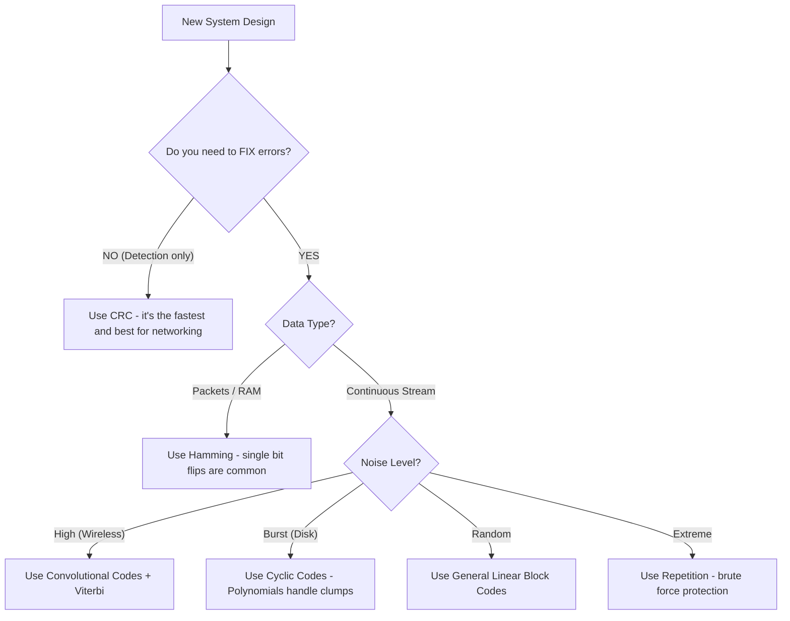

# ECC Comparison: Choosing Your Weapon

> **The Big Picture**: We've seen many ways to protect data. But in the real world, engineering is about trade-offs. You can't have perfect correction, zero overhead, and simple hardware all at once.

---

## 1. Summary Table: The ECC Landscape

| Code Type | Strategy | Best For... | Efficiency | Complexity |
| :--- | :--- | :--- | :--- | :--- |
| **Parity Check** | Add 1 bit | Detecting rare errors | **99%** | Very Low |
| **Repetition** | Repeat bits | Extreme noise (Deep Space) | **33%** | Very Low |
| **Hamming** | Binary GPS | **RAM**, Cache Memory | **70-80%**| Low |
| **Linear Block** | Matrix Math | General purpose storage | Variable | Moderate |
| **Cyclic / CRC** | Polynomials | **Ethernet**, Wi-Fi, HDD | **99%** | High (in HW) |
| **Convolutional**| Memory/Trellis | **Wireless**, Satellite, Streaming | **Variable** | High (Decoder) |

---

## 2. Decision Tree: Which Code When?

---

## 3. Real-World Applications

-   **Your Phone (5G/LTE)**: Uses advanced versions of these called "Turbo Codes" and "LDPC Codes". They are just giant Linear Block Codes with millions of bits.
-   **Your Hard Drive**: Uses "Reed-Solomon" (a type of Cyclic Code) to handle scratches on the disk surface that wipe out hundreds of bits at once.
-   **Space Missions**: NASA's Voyager 2 used a (2, 1, 7) Convolutional code concatenated with a Reed-Solomon code to send photos back from the edge of the solar system.

---

## 4. Key Takeaways for the Exam

1.  **Linearity** means $C_1 \oplus C_2 = C_3$. It makes math easy.
2.  **Generator Matrix (G)** is the encoder; **Parity Check (H)** is the validator.
3.  **Cyclic Codes** use Polynomials because they are fast in hardware (LFSR).
4.  **Convolutional Codes** use **Memory** to handle noise over time.
5.  **Viterbi Algorithm** uses **Dynamic Programming** to find the most likely path through a Trellis.

---
**Series Complete.**
[[26 - Block Code Basics and Foundation]] | [[27 - Linear Block Codes]] | [[28 - Hamming Codes]] | [[29 - Cyclic Codes]] | [[30 - Cyclic Redundancy Checks (CRC)]] | [[32 - Convolutional Codes: Foundations and Encoding]] | [[33 - The Viterbi Algorithm: Decoding and Trellis Math]]
